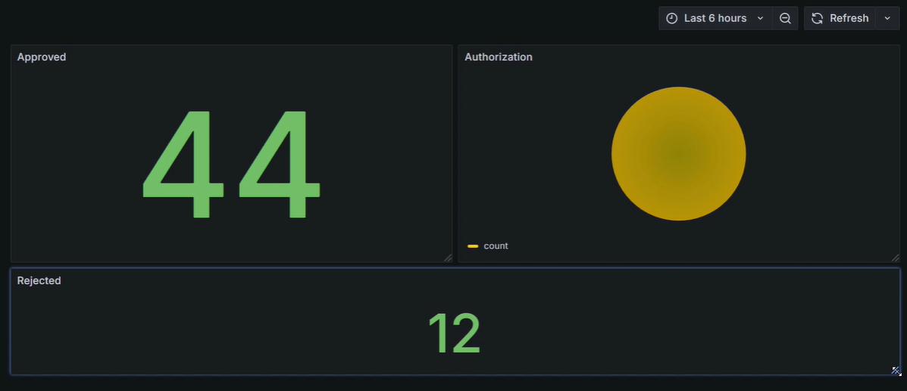

# Fraud Monitoring with Grafana

This project provides a monitoring system for credit card transaction fraud. It uses **Grafana** for real-time visualization and monitoring, and **PostgreSQL** hosted on **AWS RDS** for secure data storage.

---

## Project Overview
The system is designed to identify and monitor fraudulent activities in credit card transactions. Key features include:

- **Data Storage**: Transaction data is securely stored in PostgreSQL hosted on AWS RDS.
- **Monitoring Dashboard**: Grafana visualizes transaction data and detects anomalies.
- **Local Application**: The main application runs locally, connecting to the RDS database.

---

## Features
- **Real-time Fraud Monitoring**: Identify and track fraudulent activities in credit card transactions.
- **Customizable Dashboards**: Use Grafana to create interactive visualizations and set up alerts.
- **Secure Data Storage**: All transaction data is stored in PostgreSQL hosted on AWS RDS.

---

## Project Structure
```
FRAUD-MONITORING-WITH-GRAFANA/
│── venv/                   # Virtual environment for Python dependencies
│── .env                    # Environment variables for database connection
│── .gitignore              # Files and folders to ignore in version control
│── app.ipynb               # Jupyter Notebook for data processing and monitoring
│── README.md               # Project documentation
│── requirements.txt        # Python dependencies
```

---

## Prerequisites

Ensure you have the following installed:
- **Python 3.x**
- **PostgreSQL** (AWS RDS database instance)
- **Grafana** (hosted locally or on a separate server)

---

## Setup Instructions

### 1. Clone the Repository
```bash
git clone https://github.com/tasnimuldatascience/Fraud-Monitoring-With-Grafana.git
cd Fraud-Monitoring-With-Grafana
```

### 2. Configure Environment Variables
Create a `.env` file in the root directory based on the `.env_example` structure and update the values:
```plaintext
HOST=<your_rds_endpoint>
PORT=5432
DB_NAME=<your_database_name>
USER=<your_database_user>
PASSWORD=<your_database_password>
```

### 3. Create and Activate Virtual Environment
```bash
python -m venv venv
source venv/bin/activate  # On Windows: venv\Scripts\activate
```

### 4. Install Dependencies
```bash
pip install -r requirements.txt
```

### 5. Run the Application
Open the Jupyter Notebook:
```bash
jupyter notebook app.ipynb
```
Run the notebook cells to process and monitor data.

### 6. Set Up Grafana Dashboard
- Connect Grafana to your PostgreSQL RDS database.
- Create dashboards to visualize transaction data and set up alerts for anomalies.

---

## Technologies Used
- **Python** (pandas, NumPy, psycopg2 for PostgreSQL interaction)
- **PostgreSQL** (AWS RDS for transaction data storage)
- **Grafana** (Real-time monitoring and alerting)

## Grafana Dashboard
Below is a preview of the Grafana dashboard used for monitoring fraud in credit card transactions:

